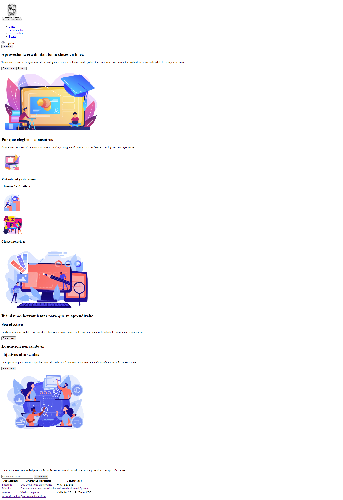

<h1>Taller 9 Danny Garcia</h1>

<h2> Información</h2>

Curso: full Stack Basico - Grupo 1

Profesor: Cristian Patiño

<h2> Punto 1: Link figma</h2>

<a href="https://www.figma.com/file/iUl0O2TLWKgVkphr7x9gXG/Danny-Garcia---Proyecto-Figma?type=design&node-id=0%3A1&mode=design&t=Zz4S9AblxA5ib2n0-1" target="_blank">Link de Figma</a>

<h2>Punto 2: HTML </h2>

